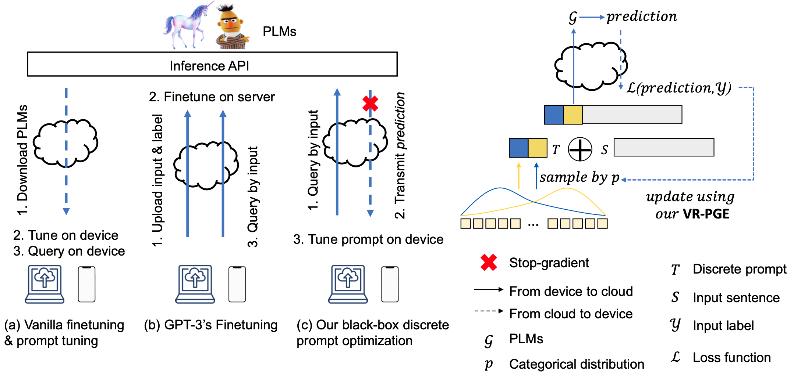

# Black-Box-Prompt-Learning

Source code for the TMLR paper ["Black-Box Prompt Learning for Pre-trained Language Models"](https://arxiv.org/abs/2201.08531)

## Model

We establish a Black-box Discrete Prompt Learning (BDPL) to resonate with pragmatic interactions between the cloud infrastructure and edge devices. 
Particularly, instead of fine-tuning the model in the cloud, we adapt PLMs by prompt learning, which efficiently optimizes only a few parameters of the discrete prompts.
Moreover, we consider the scenario that we do not have access to the parameters and gradients of the pre-trained models, except for its outputs given inputs. 
This black-box setting secures the cloud infrastructure from potential attack and misuse to cause a single-point failure, which is preferable to the white-box counterpart by current infrastructures. 
Under this black-box constraint, we apply a variance-reduced policy gradient algorithm to estimate the gradients of parameters in the categorical distribution of each discrete prompt. 
In light of our method, the user devices can efficiently tune their tasks by querying the PLMs bounded by a range of API calls. 
Our experiments on RoBERTa and GPT-3 demonstrate that the proposed algorithm achieves significant improvement on eight benchmarks in a cloud-device collaboration manner. 

The overall architechture of BDPL is shown in the figure below.



## Requirements
run `source install.sh` to create virtual enviornment and install all dependencies automatically.

## Quick Start
1. For RoBERTa-based experiments, run the scripts via `bash run.sh`. 


2. For GPT-3-based experiments, run the scripts via `bash run.sh`. Please remember to obtain your [OpenAI API Key](https://openai.com/api/) first and pass it by `--api_key`.

3. Important arguments:
   * `--task_name`: The name of a glue task. choices = `[mrpc, qnli, cola, rte]`.
   * `--file_name`: The name of the domain-specific task. choices = `[CI, SE, RCT, HP]`.
   * `--ce_loss`: if true, use cross-entropy loss. otherwise, use hinge loss.
   * `--prompt_length`: number of prompt.
   * `--k_shot`: number of shots.
   * `--api_key`: GPT-3 openai access key.

## Datasts
1. Generic datasets from [GLUE benchmark](https://gluebenchmark.com/): MNLI, QQP, SST-2, MRPC, CoLA, QNLI, RTE
2. Domain-specific datasets:
Following [**Gururangan et al. (2020)**](https://arxiv.org/abs/2004.10964) and [**Diao et al. (2021)**](https://aclanthology.org/2021.acl-long.259.pdf), we conduct our experiments on four domain-specific datasets spanning computer science, biomedical science, and reviews domains. They are: 
* **CitationIntent**: contains around 2,000 citations annotated for their function;
* **SciERC**: consists of 500 scientific abstracts annotated for relation classification; 
* **RCT**: contains approximately 200,000 abstracts from public medicine with the role of each sentence clearly identified;
* **HyperPartisan**: which contains 645 articles from Hyperpartisan news with either extreme left-wing or right-wing stand-point used for partisanship classification;


The datasets can be downloaded from [the code associated with the Don't Stop Pretraining ACL 2020 paper](https://github.com/allenai/dont-stop-pretraining).
Please create a folder `./dataset` in the root directory and put the downloaded datasets into it.
After downloading, please convert them to *`.tsv` files referring to the script [convert_dont_stop_corpus.py](https://github.com/shizhediao/T-DNA/blob/main/data/convert_dont_stop_corpus.py).

To construct the candidate prompt vocabulary, we use the script provided by [the code associated with the Taming Pre-trained Language Models with N-gram Representations for Low-Resource Domain Adaptation](https://github.com/shizhediao/T-DNA) and made some changes. Please run `pmi_ngram.py` with the following parameters:
   * `--dataset`: the path of training data file
   * `--output_dir`: the path of output directory

You can download the candidate prompt vocabulary [here](https://drive.google.com/file/d/1-Mibhq_1XmtVR0jECp_rBlFbvwmgTCDS/view?usp=drive_link). 

## Contact information

For help or issues using BDPL, please submit a GitHub issue.

For personal communication related to BDPL, please contact Shizhe Diao (`sdiaoaa@connect.ust.hk`).

## Citation

If you use or extend our work, please cite the following paper:
```
@article{diao2023black,
  title={Black-box Prompt Learning for Pre-trained Language Models},
  author={Diao, Shizhe and Huang, Zhichao and Xu, Ruijia and Li, Xuechun and Lin, Yong and Zhou, Xiao and Zhang, Tong},
  journal={Transactions on Machine Learning Research},
  year={2023}
}
```